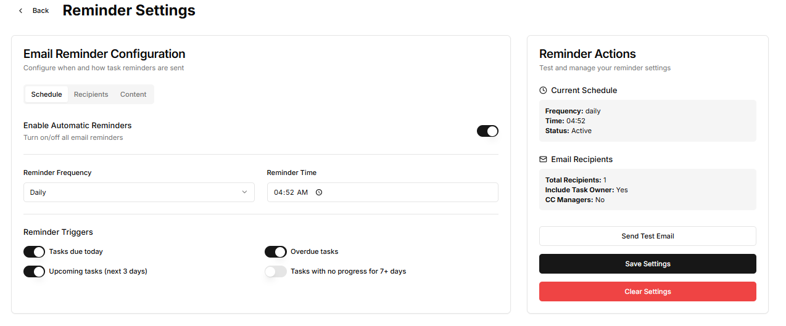
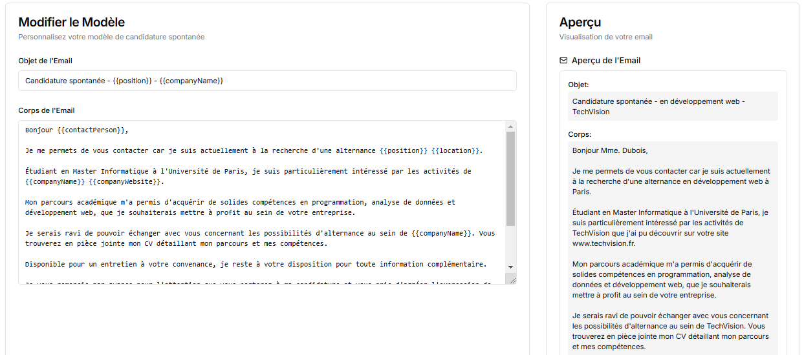
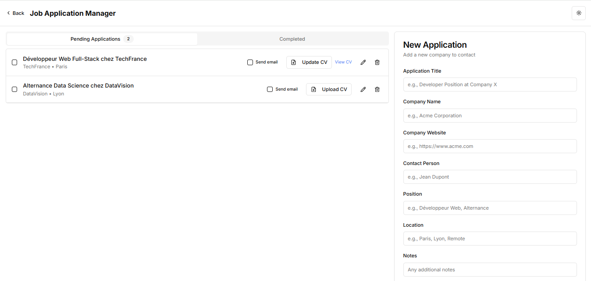
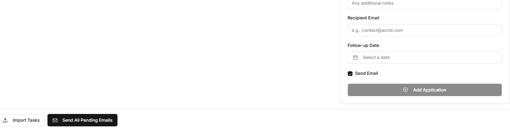

# A1ST - Spontaneous Job Application Manager

A comprehensive application for tracking job applications, managing CVs, and sending automatic email reminders for follow-ups.

## Features

- **Task Management**: Create, edit, and manage job application tasks
- **Email Reminders**: Set up automatic reminders for pending applications
- **Email Templates**: Customize email templates for professional communications
- **CV Management**: Upload and manage your CV for each application
- **Application Tracking**: Monitor application status (pending or completed)
- **Data Import/Export**: Import and export your application data

## Getting Started

1. Clone the repository
2. Install dependencies with `npm install`
3. Start the development server with `npm run dev`
4. Navigate to `http://localhost:3000` to access the application

## Application Structure

- **Tasks Page**: Create and manage job applications
- **Reminders Page**: Configure automatic email reminders
- **Templates Page**: Customize email templates
- **Settings**: Manage application settings

## Technologies Used

- Next.js
- React
- Node.js
- Shadcn UI Components
- JSON Server (for data storage)

## Scheduler Server

The application includes a scheduler server that:
- Sends automatic email reminders based on configured settings
- Resets reminder status for tasks
- Manages email delivery for pending applications

## Configuration

Email reminder settings can be configured in the `public/settings/reminderSettings.json` file, including:
- Reminder frequency (daily, weekly)
- Reminder time
- Email recipients
- Email content preferences

## License

MIT
